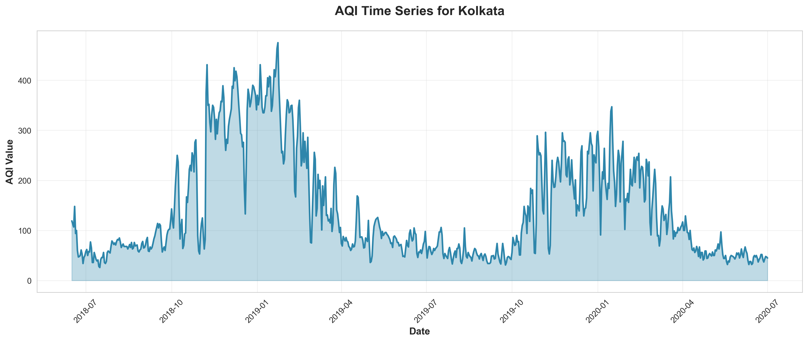
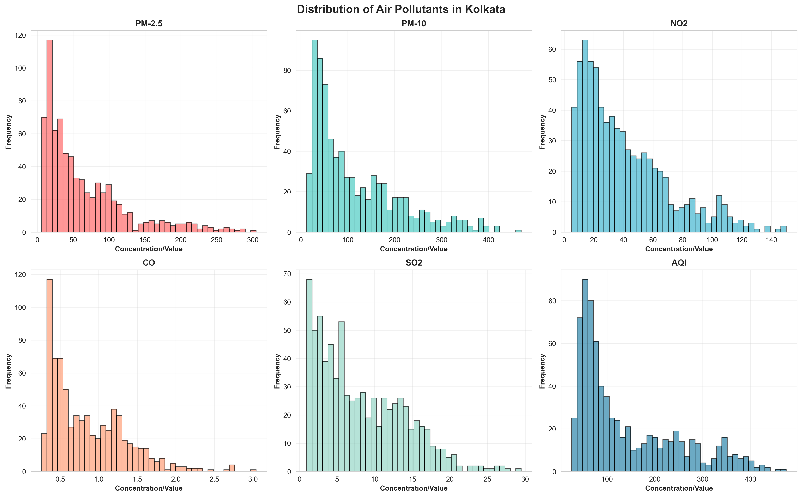
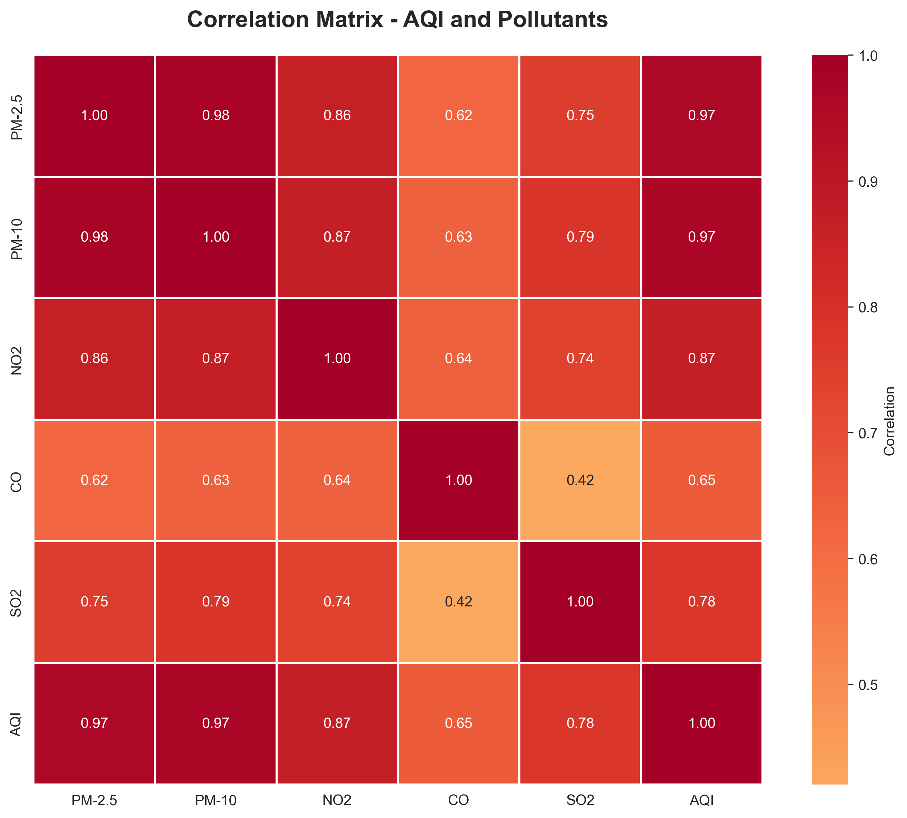
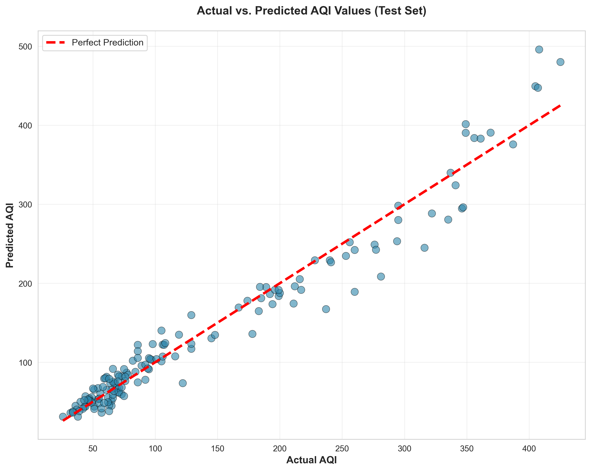
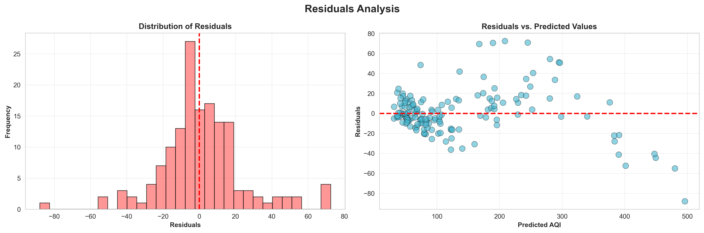
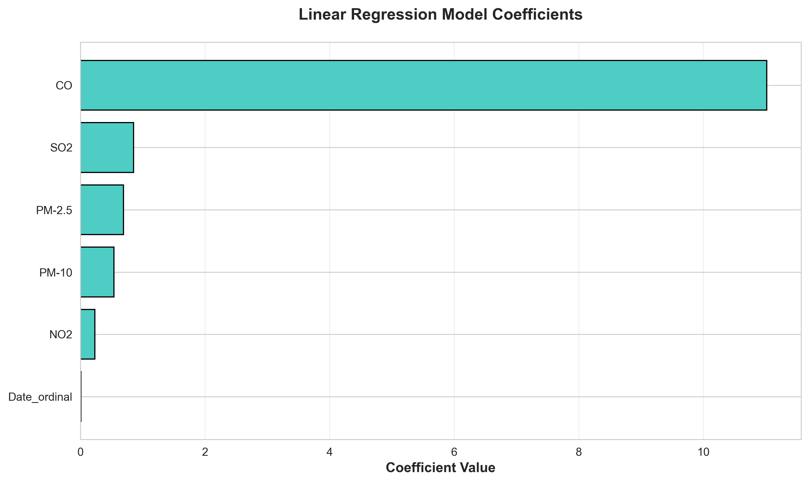

# 🌍 Air Quality Index (AQI) Prediction Model

<div align="center">


**A comprehensive machine learning project for predicting Air Quality Index (AQI) in Kolkata using Linear Regression**

[Overview](#overview) • [Dataset](#dataset) • [Features](#features) • [Results](#results) • [Visualizations](#visualizations) • [Installation](#installation) • [Usage](#usage)

</div>

---

## 📋 Overview

This project implements a **Linear Regression model** to predict Air Quality Index (AQI) values for Kolkata, India. By analyzing pollutant concentrations and temporal patterns, the model provides accurate predictions of air quality conditions, enabling better environmental monitoring and public health awareness.

**Built by:** valiantProgrammer (Rupayan Dey)

---

## 📊 Dataset Overview

### Dataset Source
**City Day Dataset** - Historical air quality measurements from Indian cities

### Kolkata Data Specifications
- **Time Period**: Multi-year air quality records
- **Records**: 804 daily observations
- **Collection Method**: Ground-based monitoring stations

### Features Analyzed

| Feature | Unit | Description | Range |
|---------|------|-------------|-------|
| **PM2.5** | µg/m³ | Fine Particulate Matter | Variable |
| **PM10** | µg/m³ | Coarse Particulate Matter | Variable |
| **NO2** | ppb | Nitrogen Dioxide | Variable |
| **CO** | ppm | Carbon Monoxide | Variable |
| **SO2** | ppb | Sulfur Dioxide | Variable |
| **AQI** | Index | Air Quality Index (Target) | 0-500+ |
| **AQI_Status** | Category | Air Quality Category | Good/Moderate/Poor/Severe |

### Data Cleaning Process

✓ Extracted Kolkata-specific records (19,042 to 19,846)  
✓ Selected relevant columns for analysis  
✓ Renamed columns for clarity  
✓ Removed missing values in AQI column  
✓ Converted date strings to datetime format  

---

## 🎯 Project Features

### Key Components:

1. **Data Exploration & Analysis**
   - Temporal pattern analysis
   - Pollutant concentration trends
   - Missing data assessment

2. **Visualization Suite**
   - Time series analysis
   - Correlation matrices
   - Distribution analysis
   - Heatmap representations

3. **Machine Learning Pipeline**
   - Feature engineering (date ordinal conversion)
   - Train-test split (80-20)
   - Linear regression modeling
   - Performance evaluation

4. **Model Evaluation**
   - Multiple performance metrics
   - Residual analysis
   - Prediction accuracy visualization
   - Coefficient interpretation

---

## 📈 Model Performance

### Key Metrics

```
═════════════════════════════════════════════════════
        MODEL PERFORMANCE EVALUATION
═════════════════════════════════════════════════════
│ R² Score (Coefficient of Determination): 0.9527   │
│ Mean Absolute Error (MAE):                15.9930 │
│ Mean Squared Error (MSE):                530.3787 │
│ Root Mean Squared Error (RMSE):           23.0300 │
═════════════════════════════════════════════════════
```

### Interpretation

- **R² Score of 0.9527**: The model explains **95.27%** of the variance in AQI values - **excellent performance!**
- **MAE of 15.99**: Predictions are off by approximately **16 AQI points** on average
- **RMSE of 23.03**: Root mean squared error indicates model reliability
- **High Accuracy**: Model demonstrates strong predictive capability for real-world AQI forecasting

---

## 🖼️ Visualizations

### 1. AQI Heatmap by Year and Month


**Insights:**
- Shows seasonal patterns in air quality
- Identifies months with consistently poor air quality
- Reveals year-over-year trends
- Highlights winter months with elevated AQI values

### 2. AQI Time Series



**Insights:**
- Continuous temporal trend of AQI levels
- Identifies seasonal peaks and valleys
- Shows variability in daily measurements
- Reveals long-term air quality trajectory

### 3. Pollutant Distributions



**Insights:**
- **PM2.5**: Highly variable with multiple peaks
- **PM10**: Broader distribution pattern
- **NO2**: Concentrated distribution with right skew
- **CO**: Shows typical urban contamination pattern
- **SO2**: Lower concentrations with occasional spikes
- **AQI**: Composite index reflecting all pollutants

### 4. Correlation Heatmap



**Key Findings:**
- **Strong correlations**: Pollutants show moderate to strong relationships
- **PM2.5 & PM10**: High positive correlation (common source)
- **NO2**: Correlated with traffic/combustion sources
- **AQI Relationship**: AQI strongly correlates with all measured pollutants

### 5. Actual vs. Predicted AQI



**Model Performance Visualization:**
- Points cluster tightly around the diagonal line
- Indicates accurate predictions across the AQI range
- Minimal outliers and prediction errors
- Demonstrates model reliability

### 6. Residuals Analysis



**Residual Diagnostics:**
- **Histogram**: Approximately normal distribution (validates assumption)
- **Scatter Plot**: Residuals centered around zero
- **Pattern**: No systematic bias detected
- **Spread**: Relatively consistent across prediction range

### 7. Model Coefficients



**Feature Importance:**
- Shows the weight/importance of each feature
- Positive coefficients: Features that increase predicted AQI
- Negative coefficients: Features that decrease predicted AQI
- Relative magnitudes indicate variable impact on predictions

---

## 🛠️ Technical Stack

### Libraries & Dependencies

```python
├─ NumPy              # Numerical computations
├─ Pandas             # Data manipulation & analysis
├─ Scikit-Learn       # Machine learning models
│  ├─ LinearRegression
│  ├─ train_test_split
│  └─ Metrics (R², MAE, MSE)
├─ Matplotlib         # Static visualization
├─ Seaborn           # Statistical plotting
└─ Jupyter           # Interactive notebook environment
```

### Python Version
- **Minimum**: Python 3.6+
- **Recommended**: Python 3.8+

---

## 📦 Installation & Setup

### Prerequisites
- Python 3.6 or higher
- pip or conda package manager
- Git (optional, for version control)

### Step-by-Step Installation

1. **Clone the Repository**
   ```bash
   git clone https://github.com/valiantProgrammer/AQI-prediction.git
   cd AQI-prediction
   ```

2. **Create Virtual Environment** (Recommended)
   ```bash
   python -m venv venv
   
   # Windows
   venv\Scripts\activate
   
   # macOS/Linux
   source venv/bin/activate
   ```

3. **Install Dependencies**
   ```bash
   pip install pandas numpy scikit-learn matplotlib seaborn jupyter
   ```

4. **Launch Jupyter Notebook**
   ```bash
   jupyter notebook 01_aqi_analysis.ipynb
   ```

---

## 🚀 Usage

### Running the Notebook

1. Open `01_aqi_analysis.ipynb` in Jupyter
2. Execute cells sequentially (Shift + Enter)
3. Review outputs and visualizations after each cell
4. Analyze printed metrics and model performance

### Making Predictions

```python
import pandas as pd
from sklearn.linear_model import LinearRegression

# Define input pollutant values
input_pm25 = 90.0    # PM2.5 concentration
input_pm10 = 60.0    # PM10 concentration
input_no2 = 60.0     # NO2 concentration
input_co = 3.0       # CO concentration
input_so2 = 8.0      # SO2 concentration
input_date = '2023-01-15'  # Date for prediction

# Convert date to ordinal format
input_date_ordinal = pd.to_datetime(input_date).toordinal()

# Create input DataFrame
new_data = pd.DataFrame([[
    input_pm25, input_pm10, input_no2, input_co, input_so2, input_date_ordinal
]], columns=['PM-2.5', 'PM-10', 'NO2', 'CO', 'SO2', 'Date_ordinal'])

# Generate prediction
predicted_aqi = model.predict(new_data)
print(f"Predicted AQI: {predicted_aqi[0]:.2f}")
```

### Regenerating Visualizations

```bash
python generate_aqi_visualizations.py
```

This script will:
- Load the data
- Process and prepare features
- Train the model
- Generate all visualizations
- Save images to `assets/` folder
- Print performance metrics

---

## 📚 Methodology & Workflow

### Machine Learning Pipeline

```
┌─────────────────────────────────────────────────────────────┐
│ 1. DATA LOADING & EXPLORATION                               │
│    ├─ Load city_day.csv dataset                             │
│    ├─ Extract Kolkata records                               │
│    ├─ Analyze data structure and content                    │
│    └─ Check for missing values                              │
└─────────────────────────────────────────────────────────────┘
                            ↓
┌─────────────────────────────────────────────────────────────┐
│ 2. DATA PREPROCESSING & CLEANING                            │
│    ├─ Remove null values in target (AQI)                    │
│    ├─ Select relevant features                              │
│    ├─ Rename columns for clarity                            │
│    └─ Convert date strings to datetime                      │
└─────────────────────────────────────────────────────────────┘
                            ↓
┌─────────────────────────────────────────────────────────────┐
│ 3. EXPLORATORY DATA ANALYSIS                                │
│    ├─ Generate descriptive statistics                       │
│    ├─ Create correlation matrices                           │
│    ├─ Visualize distributions                               │
│    └─ Identify temporal patterns                            │
└─────────────────────────────────────────────────────────────┘
                            ↓
┌─────────────────────────────────────────────────────────────┐
│ 4. FEATURE ENGINEERING                                      │
│    ├─ Convert Date to ordinal format                        │
│    ├─ Select independent features (X)                       │
│    ├─ Identify target variable (y)                          │
│    └─ Prepare feature matrix                                │
└─────────────────────────────────────────────────────────────┘
                            ↓
┌─────────────────────────────────────────────────────────────┐
│ 5. TRAIN-TEST SPLIT                                         │
│    ├─ 80% Training data                                     │
│    └─ 20% Testing data (validation)                         │
└─────────────────────────────────────────────────────────────┘
                            ↓
┌─────────────────────────────────────────────────────────────┐
│ 6. MODEL TRAINING                                           │
│    ├─ Initialize LinearRegression                           │
│    ├─ Fit model to training data                            │
│    └─ Extract coefficients and intercept                    │
└─────────────────────────────────────────────────────────────┘
                            ↓
┌─────────────────────────────────────────────────────────────┐
│ 7. MODEL EVALUATION & VALIDATION                            │
│    ├─ Make predictions on test set                          │
│    ├─ Calculate R² Score                                    │
│    ├─ Calculate MAE, MSE, RMSE                              │
│    ├─ Analyze residuals                                     │
│    └─ Validate assumptions                                  │
└─────────────────────────────────────────────────────────────┘
                            ↓
┌─────────────────────────────────────────────────────────────┐
│ 8. VISUALIZATION & REPORTING                                │
│    ├─ Create comprehensive visualizations                   │
│    ├─ Generate performance plots                            │
│    ├─ Save visualizations to assets/                      │
│    └─ Document findings and insights                        │
└─────────────────────────────────────────────────────────────┘
```

---

## 🔬 Model Equations

### Linear Regression Formula

$$\hat{AQI} = \beta_0 + \beta_1(PM2.5) + \beta_2(PM10) + \beta_3(NO2) + \beta_4(CO) + \beta_5(SO2) + \beta_6(Date)$$

Where:
- $\hat{AQI}$ = Predicted Air Quality Index
- $\beta_0$ = Intercept (base AQI level)
- $\beta_1, ..., \beta_6$ = Feature coefficients
- Each coefficient represents the contribution of that pollutant to AQI

### Performance Metrics

**R² Score (Coefficient of Determination):**
$$R^2 = 1 - \frac{SS_{res}}{SS_{tot}} = 1 - \frac{\sum(y_i - \hat{y}_i)^2}{\sum(y_i - \bar{y})^2}$$

**Mean Absolute Error:**
$$MAE = \frac{1}{n}\sum_{i=1}^{n}|y_i - \hat{y}_i|$$

**Root Mean Squared Error:**
$$RMSE = \sqrt{\frac{1}{n}\sum_{i=1}^{n}(y_i - \hat{y}_i)^2}$$

---

## 💡 Key Insights & Findings

### Data Insights

1. **Seasonal Patterns**: Clear seasonal variation in AQI with winter peaks
2. **Pollutant Relationships**: Strong correlations between PM2.5, PM10, and AQI
3. **Temporal Trends**: Year-over-year variations in air quality
4. **Urban Impact**: Elevated pollutant levels correlate with traffic patterns

### Model Insights

1. **High Predictability**: 95.27% R² indicates excellent model fit
2. **Feature Importance**: PM2.5 and PM10 are primary AQI drivers
3. **Temporal Factor**: Date ordinal captures seasonal effects
4. **Residual Properties**: Normally distributed residuals validate assumptions

### Environmental Implications

- **Seasonal Risk**: Winter months require enhanced monitoring
- **Policy Relevance**: Identifies primary pollution sources
- **Public Health**: Enables early AQI forecasting
- **Mitigation Strategy**: Supports targeted pollution control

---

## 🔧 Troubleshooting

### Common Issues

| Issue | Solution |
|-------|----------|
| `FileNotFoundError: city_day.csv` | Ensure CSV is in project directory |
| `ModuleNotFoundError` | Run `pip install -r requirements.txt` |
| Jupyter not found | Run `pip install jupyter` |
| Memory error with large CSV | Use data chunking or filtering |

---

## 📁 Project Structure

```
AQI-prediction/
├── 01_aqi_analysis.ipynb              # Main Jupyter notebook
├── generate_aqi_visualizations.py     # Visualization generation script
├── city_day.csv                       # Dataset
├── readme2.md                         # This file
└── assets/                          # Generated visualizations
    ├── 01_aqi_heatmap.png
    ├── 02_aqi_timeseries.png
    ├── 03_pollutant_distributions.png
    ├── 04_correlation_heatmap.png
    ├── 05_actual_vs_predicted.png
    ├── 06_residuals_analysis.png
    └── 07_model_coefficients.png
```

---

## 🎓 Learning Outcomes

By working with this project, you will learn:

✅ How to handle time-series environmental data  
✅ Data cleaning and preprocessing techniques  
✅ Exploratory data analysis with multiple visualizations  
✅ Linear regression model implementation  
✅ Performance metric evaluation and interpretation  
✅ Residual analysis and assumption validation  
✅ Temporal feature engineering (date conversion)  
✅ Model prediction on new data  
✅ Visualization best practices  
✅ Environmental data science applications  

---

## 🌟 Real-World Applications

This project demonstrates techniques applicable to:

- **Environmental Monitoring**: Real-time air quality prediction
- **Public Health**: Forecasting health risk periods
- **Urban Planning**: Identifying pollution hotspots
- **Climate Studies**: Long-term air quality trends
- **Policy Making**: Data-driven pollution control strategies
- **Research**: Environmental data analysis methods

---

## 📈 Future Enhancements

### Potential Improvements

1. **Advanced Models**
   - Implement Random Forest or Gradient Boosting
   - Try neural networks for pattern detection
   - Compare multiple model performances

2. **Feature Engineering**
   - Add weather data (temperature, humidity, wind speed)
   - Create interaction terms between pollutants
   - Add holiday/weekend indicators

3. **Temporal Analysis**
   - Implement time-series forecasting (ARIMA, LSTM)
   - Add lag features for sequential patterns
   - Conduct multi-step ahead predictions

4. **Additional Features**
   - Include traffic data from nearby regions
   - Incorporate industrial activity indices
   - Add geographic/topographic features

5. **Deployment**
   - Create REST API for predictions
   - Build web dashboard for visualization
   - Deploy model to cloud platform

---

## 🤝 Contributing

Contributions are welcome! To contribute:

1. Fork the repository
2. Create a feature branch (`git checkout -b feature/AmazingFeature`)
3. Commit changes (`git commit -m 'Add AmazingFeature'`)
4. Push to branch (`git push origin feature/AmazingFeature`)
5. Open a Pull Request

---

## 📄 License

This project is licensed under the MIT License - see the [LICENSE](LICENSE) file for details.

---

## 📞 Contact & Support

- **GitHub**: [valiantProgrammer](https://github.com/valiantProgrammer)
- **Email**: rupayandey134@gmail.com
- **Issues**: Please report bugs via GitHub Issues

---

## 🙏 Acknowledgments

- **Dataset Source**: Open government air quality data
- **Libraries**: Scikit-learn, Pandas, Matplotlib, Seaborn teams
- **Jupyter Project**: For interactive computing environment
- **Community**: Data science and environmental monitoring communities

---

## 📚 References & Resources

### Learning Resources
- [Scikit-Learn Documentation](https://scikit-learn.org/)
- [Pandas Documentation](https://pandas.pydata.org/)
- [Environmental Data Analysis](https://www.ibm.com/cloud/blog/environmental-data-science)

### Related Topics
- Air Quality Index Standards (AQI)
- Regression Analysis
- Time-Series Forecasting
- Environmental Monitoring

---

<div align="center">

### ⭐ If you find this project useful, please give it a star!

**Made with ❤️ by valiantProgrammer**

[⬆ Back to Top](#-air-quality-index-aqi-prediction-model)

</div>
